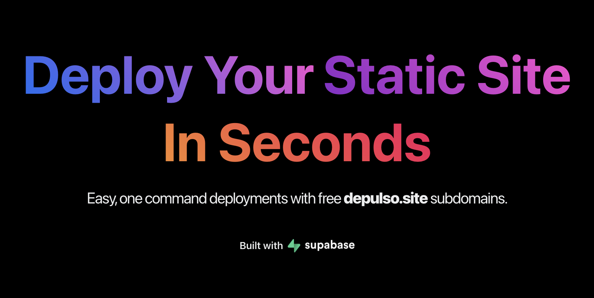

# Depulso

[Demo Video on YouTube](https://youtu.be/wHNnb_IW4tE)

[Depulso](https://depulso.co) - Deploy Your Static Site In Seconds | Easy, one command deployments with free depulso.site subdomains.

- Built during [Supabase Launch Week 6 Hackathon](https://supabase.com/blog/launch-week-6-hackathon)

- This is a monorepo consisting of 5 workspaces.
  - [Web App](./apps/web/README.md)
  - [Depulso CLI](./packages/cli/README.md)
  - [Auth App](./apps/auth/README.md)
  - [API](./apps/api/README.md)
  - [Proxy](./apps/proxy/README.md)

## Built with

- Supabase
  - Auth
  - Storage
- Fly.io
  - HTTP proxy
  - API server
- Cloudflare DNS
- React.js / Next.js

## Features

- Customizable `depulso.site` subdomains
- FREE SSL for every project
- Quick deployments with CLI

## Soft Limitations

- Max 10MB per deployment
- Max 3 projects per user
